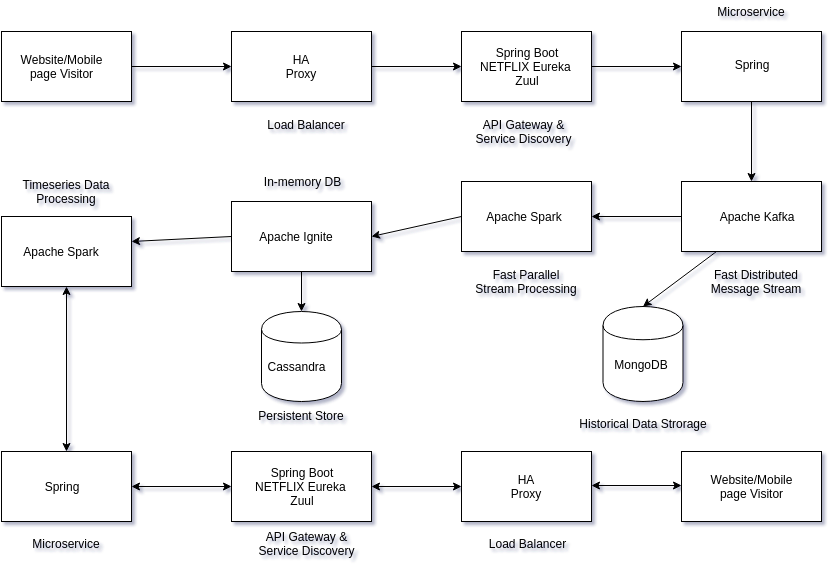

## Google Analytics like Backend high level system design 

### System Requirements

- Handle large write volume: Billions write events per day.
- Handle large read/query volume: Millions merchants want to get insight about their business. Read/Query patterns are time-series related metrics.
- Provide metrics to customers with at most one hour delay.
- Run with minimum downtime.
- Have the ability to reprocess historical data in case of bugs in the processing logic.

## Scale 

This section estimate the base scale of the system.   
Scaling, Partitioning, Load Balancing and Caching of system will base on this estimation.

### Use-case Assumptions

~10 billion write events per day
- Write QPS : 10G / (24 * 3600 seconds) = ~120K/s

~100M merchants perform 10 read queries per day
- Read QPS : 100M * 10 / (24 * 3600 seconds) = ~12K/s

Assuming we store every event for 5 years in the first layer of permanent storage.   

Since we have 10G of write data per day, 
- Number of event per year : 10G * 365 days = ~4T/year

Assuming average size of event is 1K, 
- Volume of data for 5 years : 4T * 5 years * 1K = 20P 

_Data compression algorithm of data store or middleware is not considered in this design_

### Bandwidth Requirement

Since write QPS is 120K/s and the size of data is 1K,
- Total incomming data per second : 120K/s * 1K = 120G/s

Since read QPS is 12K/s,
- Total outgoing data per second : 12K/s * 1K = 12G/s

### Memory Requirement

- The data can be stored in memory using a distributed cache, in-memory database grid or embedded database.
- This section will assume that we use a distributed cache server to hold certain analysis reports over a certain period.

Assuming the size of each analysis report as 100K,
- Size of analysis report per week : 100K * 6 * 24 hours * 7 days = ~100G per week

If we need to cache raw level of analysis report for 4 weeks, we need 400G of memory in total
- Size of analysis report for 4 weeks : 100G/week * 4 weeks = 400G

### High level system requirements

Following are the estimate system requirements as discussed above

1. Write QPS - 120K/s
2. Read QPS - 12K/s
3. Storage for 5 years - 20PB
4. Incoming Bandwidth - 120G/s
5. Outgoing Bandwidth - 12/s
6. Cache Memory - 400GB

### Database Design

- We need to store huge amounts of data for which we need storage that is scalable.
- Horizontal Partitioning (Sharding) is required but Vertical partitioning is not required since the size of each individual object would be small. 
- Databases that guarantee _AP_ should be preferred ( Cassandra,NoSQL DBs such as MongoDB )

## High level System Architecture

- We choose Microservices because scalability is required for Google Analytics (GA) like backend. 
- Micro services enable us to elastically scale horizontally in response to incoming network traffic into the system. 
- And a distributed stream processing pipeline scales in proportion to the load.

High level architecture of analysis system is as below : 

### Web/Mobile Visitor Tracking Code

- Every web page or mobile site tracked embeds a tracking code that collects data about the visitor. 
- It loads an async script that assigns a tracking cookie to the user if it is not set. It also sends an XHR request for every user interaction.

### HAProxy Load Balancer

HAProxy (High Availability Proxy), is a popular open source software TCP/HTTP Load Balancer and proxying solution. Its most common use is to improve the performance and reliability of a server environment by distributing the workload across multiple servers. 

Adding more servers to the backend will increase the potential load capacity by spreading the load over multiple servers. Increased reliability is also achieved through this manner, in case some backend servers become unavailable.

HAProxy routes the requests coming from Web/Mobile Visitor site to the Zuul API Gateway of the solution. Given the nature of a distributed system built for scalability and stateless request and response handling we can distribute the Zuul API gateways spread across the world.

### Spring Boot & Netflix OSS Eureka + Zuul

We use Zuul as an API gateway and edge service that proxies requests to multiple backing services. It allows any browser, mobile app or other user interface to consume services from multiple hosts. Zuul is integrated with other Netflix stack components like Hystrix for fault tolerance and Eureka for service discovery or use it to manage routing rules, filters and load balancing across your system. Most importantly all of those components are well adapted by Spring framework through Spring Boot/Cloud approach.

### Spring Boot Microservices

A microservices approach to application development can improve resilience and expedite the time to market, but breaking apps into fine-grained services has its own complications. With well-defined services and lightweight protocols, microservices offer increased modularity, making applications easier to develop, test, deploy, and, more importantly, change and maintain. With microservices, the code is broken into independent services that run as separate processes.

Scalability is the key aspect of microservices. Because each service is a separate component, we can scale up a single function or service without having to scale the entire application. Business-critical services can be deployed on multiple servers for increased availability and performance without impacting the performance of other services. Designing for failure is essential. We should be prepared to handle multiple failure issues, such as system downtime, slow service and unexpected responses. Here, load balancing is important. When a failure arises, the troubled service should still run in a degraded functionality without crashing the entire system. Hystrix Circuit-breaker will come into rescue in such failure scenarios.

The microservices are designed for scalability, resilience, fault-tolerance and high availability and importantly it can be achieved through deploying the services in a *Docker Swarm or Kubernetes cluster*. Distributed and geographically spread *Zuul API gateways* route requests from web and mobile visitors to the microservices registered in the load balanced Eureka server. 

*Microservices are a huge part of making the system run with minimum downtime*

The core processing logic of the backend system is designed for scalability, high availability, resilience and fault-tolerance using distributed Streaming Processing, the microservices will ingest data to Kafka Streams data pipeline.

### Apache Kafka Streams

Apache Kafka is used for building real-time streaming data pipelines that reliably get data between many independent systems or applications.
It allows storing streams of records in a fault-tolerant, and durable way and provides a unified, high-throughput, low-latency, horizontally scalable platform. Kafka is also a reliable and mature messaging system.

Kafka is run as a cluster on one or more servers that can span multiple datacenters spread across geographies. Those servers are usually called brokers.

Kafka uses Zookeeper to store metadata about brokers, topics and partitions.

Kafka Streams is a pretty fast, lightweight stream processing solution that works best if all of the data ingestion is coming through Apache Kafka. The ingested data is read directly from Kafka by Apache Spark for stream processing and creates Timeseries Ignite RDD (Resilient Distributed Datasets).

### Apache Spark

Spark Streaming is an extension of the core Spark API that enables scalable, high-throughput, fault-tolerant stream processing of live data streams.
It provides a high-level abstraction called a discretized stream, or DStream, which represents a continuous stream of data.

Apache Spark is a perfect choice in our use-case. This is because Spark achieves high performance for both batch and streaming data.
In our scenario Spark streaming process Kafka data streams and create and share Ignite RDDs across Apache Ignite which is a distributed memory-centric database and caching platform.

### Apache Ignite

Apache Ignite is a distributed memory-centric database and caching platform that is used by Apache Spark users to achieve true in-memory performance at scale.

Apache Ignite is designed for transactional, analytical, and streaming workloads, delivering in-memory performance at scale. 

### Apache Cassandra

We will use Apache Cassandra as storage for persistence writes from Ignite.
Apache Cassandra is a highly scalable and available distributed database that facilitates and allows storing and managing high velocity structured data across multiple commodity servers without a single point of failure.

The Apache Cassandra is an extremely powerful open source distributed database system that works extremely well to handle huge volumes of records spread across multiple commodity servers. It can be easily scaled to meet sudden increase in demand, by deploying multi-node Cassandra clusters, meets high availability requirements, and there is no single point of failure.

### Historical Data Storage

Apache Kafka provides high availability with replication cluster and Zookeeper managing the cluster.
However, messages can fail due to the speed difference between producer and consumer. 
Message queues like Kafka have fault tolerance mechanisms to deal with this such as the use of durable messaging.
With durable message, consumer with much lower speeds can still read messages reliably,and even can be in offline mode and perform batch processes when necessary.

When data is lost due to network failures, broker crashes, message queue crashes or consumer crashes, offline consumers can perform batch jobs from the durable message of historical data store.

We use NoSql DB, Mongo as our historical data storage. 